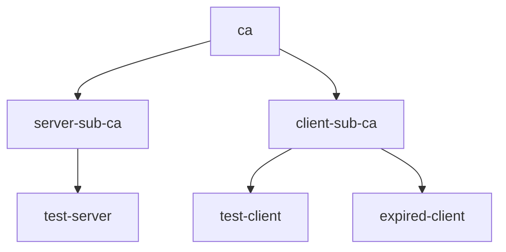

# Creating Certificates Declaratively on Command Line

With certyaml, you can declaratively specify your Public Key Infrastructure (PKI) setup, making it perfect for testing setups that require various certificates and CA hierarchies.
Let’s say you need a root CA, intermediate CAs for issuing server and client certificates, and server and client leaf certificates and expired client certificate to test how your application behaves when a certificate has expired.
Here’s how it would look like:



In `certs.yaml`, it would look like this:

```yaml
# Define the root CA certificate (self-signed).
subject: cn=ca
---
# Define a server intermediate CA, issued by the root CA.
subject: cn=server-sub-ca
issuer: cn=ca
ca: true
---
# Define a client intermediate CA, also issued by the root CA.
subject: cn=client-sub-ca
issuer: cn=ca
ca: true
---
# Define a server certificate, issued by the server intermediate CA.
subject: cn=test-server
issuer: cn=server-sub-ca
sans:
  - DNS:localhost  # Add localhost as a Subject Alternative Name.
---
# Define a client certificate, issued by the client intermediate CA.
subject: cn=test-client
issuer: cn=client-sub-ca
---
# Define an expired client certificate.
subject: cn=expired-client
issuer: cn=client-sub-ca
not_after: 2020-01-01T00:00:00Z  # Set an expiration date in the past.
```

To generate the certificate, install certyaml by following the instructions in the project [README](https://github.com/tsaarni/certyaml?tab=readme-ov-file#installing).
Don't worry, it is a single binary with no dependencies.
For example, on macOS:

```console
wget https://github.com/tsaarni/certyaml/releases/download/v0.10.0/certyaml-darwin-arm64.tar.gz
tar -xvf certyaml-darwin-arm64.tar.gz
```

Run the tool:

```console
./certyaml
```

The tool will read the configuration and output all necessary certificate and key files:

```console
Writing: ca.pem ca-key.pem
Writing: server-sub-ca.pem server-sub-ca-key.pem
Writing: client-sub-ca.pem client-sub-ca-key.pem
Writing: test-server.pem test-server-key.pem
Writing: test-client.pem test-client-key.pem
Writing: expired-client.pem expired-client-key.pem
```

You can now use the generated certificates in your tests or development environment.
For example, in Kubernetes, you can create a secret with the generated certificates:

```console
kubectl create secret tls ingress --cert=test-server.pem --key=test-server-key.pem --dry-run=client -o yaml | kubectl apply -f -
```

For more information, visit the [certyaml](https://github.com/tsaarni/certyaml) GitHub repository and refer to the [YAML syntax](https://github.com/tsaarni/certyaml?tab=readme-ov-file#yaml-syntax) documentation for more advanced usage details.
