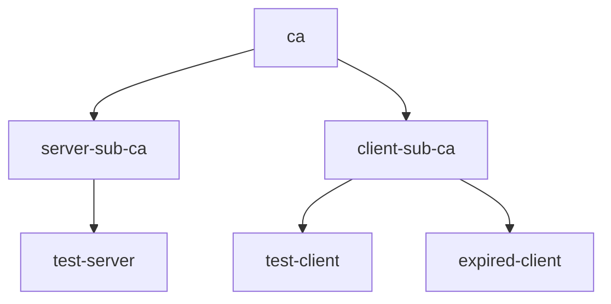

# Creating Certificates in Go

When integrating `certyaml` into your Go projects, you can generate certificates directly within your code.
Suppose you need a root CA, intermediate CAs for issuing server and client certificates, as well as server and client leaf certificates, including an expired client certificate to test how your application handles expired certificates. Here’s how it would look.



Below is the equivalent code.

```go
import (
	"time"

	"github.com/tsaarni/certyaml"
)

func main() {
	// Define the root CA (self-signed certificate).
	ca := certyaml.Certificate{Subject: "cn=ca"}

	// Define the intermediate CAs, marked as CA certificates and issued by the root CA.
	isCa := true
	serverSubCa := certyaml.Certificate{Subject: "cn=server-sub-ca", IsCA: &isCa, Issuer: &ca}
	clientSubCa := certyaml.Certificate{Subject: "cn=client-sub-ca", IsCA: &isCa, Issuer: &ca}

	// Define the server certificate, signed by the server sub-CA and with localhost as SAN.
	server := certyaml.Certificate{
		Subject:         "cn=test-server",
		SubjectAltNames: []string{"DNS:localhost"},
		Issuer:          &serverSubCa,
	}

	// Define the client certificate, signed by the client sub-CA.
	client := certyaml.Certificate{
		Subject: "cn=test-client",
		Issuer:  &clientSubCa,
	}

	// Define an expired client certificate.
	expiredAt := time.Date(2020, 1, 1, 0, 0, 0, 0, time.UTC)
	expired := certyaml.Certificate{
		Subject:  "cn=expired-client",
		Issuer:   &clientSubCa,
		NotAfter: &expiredAt,
	}
}
```

You can find an executable version of the example in [`main.go`](main.go).
To run the code, use the following command:

```console
go run main.go
```

For more information, visit the [certyaml](https://github.com/tsaarni/certyaml) GitHub repository and refer to the [API documentation](https://pkg.go.dev/github.com/tsaarni/certyaml) for more advanced usage details.
