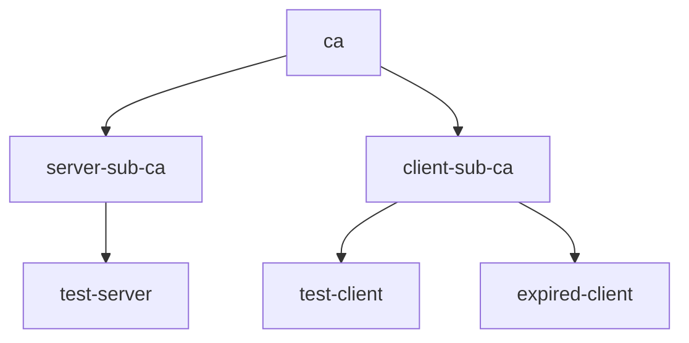

# Creating Certificates in Java

When integrating `certy` into your Java projects, you can generate certificates directly within your code.
Suppose you need a root CA, intermediate CAs for issuing server and client certificates, as well as server and client leaf certificates, including an expired client certificate to test how your application handles expired certificates. Here’s how it would look.



Below is the equivalent code.

```java
import fi.protonode.certy.Credential;

public class AppTest {
    public void testWithCerty() throws Exception {
        // Define the root CA (self-signed certificate).
        Credential ca = new Credential().subject("cn=ca").ca(true);

        // Define the intermediate CAs, marked as CA certificates and issued by the root CA.
        Credential serverSubCa = new Credential().subject("cn=server-sub-ca").ca(true).issuer(ca);
        Credential clientSubCa = new Credential().subject("cn=client-sub-ca").ca(true).issuer(ca);

        // Define the server certificate, signed by the server sub-CA and with localhost as SAN.
        Credential server = new Credential().subject("cn=test-server").issuer(serverSubCa)
                .subjectAltName("DNS:localhost");

        // Define the client certificate, signed by the client sub-CA.
        Credential client = new Credential().subject("cn=test-client").issuer(clientSubCa);

        // Define an expired client certificate.
        Credential expired = new Credential().subject("cn=expired-client").issuer(clientSubCa)
                .notAfter(Date.from(Instant.parse("2020-01-01T00:00:00Z")));
    }
}
```

You can find an executable version of the example in [`AppTest.java`](src/test/java/com/example/app/AppTest.java).
To run the code, use the following command:

```console
mvn clean test
```

For more information, visit the [java-certy](https://github.com/tsaarni/java-certy) GitHub repository and refer to the [API documentation](https://tsaarni.github.io/java-certy/) for more advanced usage details.
