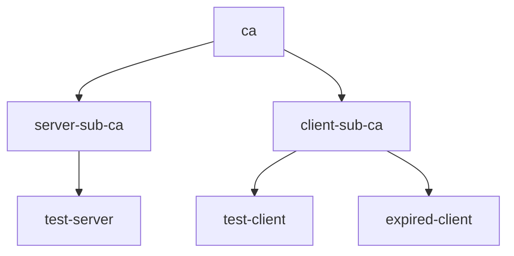

# Creating Certificates in Python

When integrating `certy` into your Python projects, you can generate certificates directly within your code.
Suppose you need a root CA, intermediate CAs for issuing server and client certificates, as well as server and client leaf certificates, including an expired client certificate to test how your application handles expired certificates. Here’s how it would look.



Below is the equivalent code.

```python
import datetime

from certy import Credential

# Define the root CA (self-signed certificate).
ca = Credential().subject("CN=ca")

# Define the intermediate CAs, marked as CA certificates and issued by the root CA.
server_sub_ca = Credential().subject("CN=server-sub-ca").ca().issuer(ca)
client_sub_ca = Credential().subject("CN=client-sub-ca").ca().issuer(ca)

# Define the server certificate, signed by the server sub-CA and with localhost as SAN.
server = (
    Credential()
    .subject("CN=test-server")
    .issuer(server_sub_ca)
    .subject_alt_names("DNS:localhost")
)

# Define the client certificate, signed by the client sub-CA.
client = (
    Credential()
    .subject("CN=test-client")
    .issuer(client_sub_ca)
)

# Define an expired client certificate.
expired = (
    Credential()
    .subject("CN=expired-client")
    .issuer(client_sub_ca)
    .not_before(datetime.datetime(2019, 1, 1, 0, 0, 0))
    .not_after(datetime.datetime(2020, 1, 1, 0, 0, 0))
)
```

You can find an executable version of this example in [`main.py`](main.py). Before running the example, create a virtual environment and install the [`certy`](https://pypi.org/project/certy/) package from PyPI.

```console
python3 -mvenv venv
source venv/bin/activate
pip install certy
```

Then, run the example:

```console
python3 main.py
```

For more information, visit the [python-certy](https://github.com/tsaarni/python-certy) GitHub repository and refer to the [API documentation](https://tsaarni.github.io/python-certy/) for advanced usage details.
